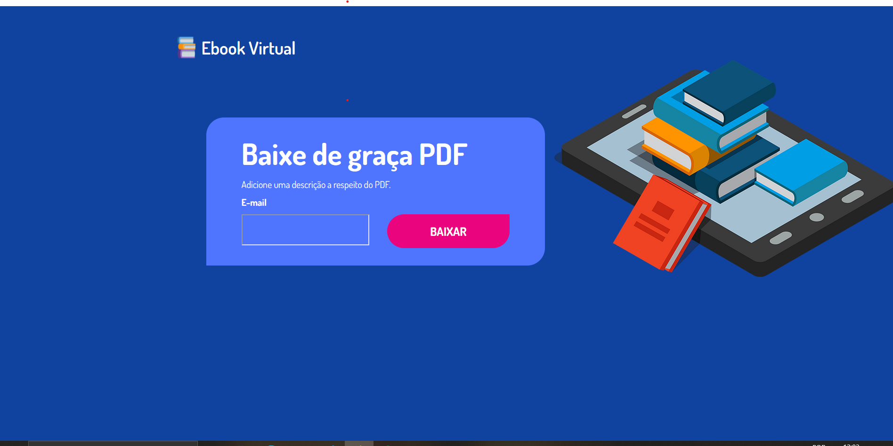

# Projeto: Download Ebook
Fiz este projeto como uma prática de meus conhecimentos em HTML e CSS.
## Imagem da página:

## Sobre o conteúdo do projeto:
Esse projeto é a criação de uma Squeeze Page, uma página do aperto é uma página de destino criada para solicitar endereços de e-mail opt-in de possíveis assinantes.
### Tecnologias utilizadas:
* HTML;
* CSS.
### Feito por:
Gustavo Baister
